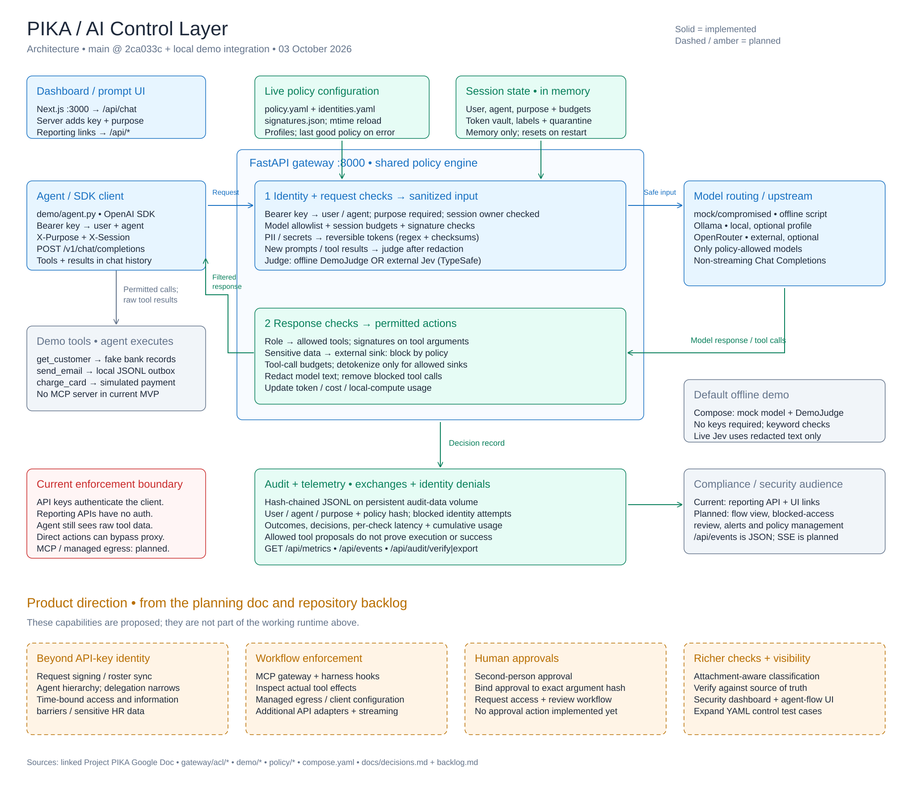

# Architecture

[Editable Excalidraw diagram](architecture.excalidraw) · [SVG preview](architecture.svg)

Open https://excalidraw.com and drag `architecture.excalidraw` onto the canvas (or use **Open**, Ctrl+O). All cards, labels, and arrows are editable. The SVG is a lightweight preview generated from the same scene. To rebuild both files, run `node docs/generate-architecture.cjs` from the repository root. Manual Excalidraw edits should be saved to the scene file; rerunning the generator replaces them.

The diagram reflects `main` at `2ca033c`, pulled on 3 October 2026, plus the local Compose/offline-demo and dashboard integration. Solid cards show implemented components; dashed amber cards show planned capabilities from the [Project PIKA planning document](https://docs.google.com/document/d/1lfxEL1jiTtgvnGqDmW90hGEDDdovrVtGTBIUaiYuwoA/edit) and [repository backlog](backlog.md). The backlog now contains parked ideas; task ownership and status live on the [project board](https://github.com/orgs/TheRealStartup/projects/1).

## Runtime

The demo agent uses the OpenAI SDK with the gateway as its `base_url`. The FastAPI `/v1/chat/completions` adapter authenticates a bearer API key against SHA-256 digests in `policy/identities.yaml`, mapping it to a user and agent. A conflicting `X-User`, invalid key, missing required `X-Purpose`, or session owned by a different user is denied and audited before model controls run. `X-Session` remains the conversation identifier. Header-only identity is an optional local-development mode; the default policy uses API keys. The Next.js prompt route adds a server-side `ACL_KEY` and a purpose; its default is the public Alice test key for the local fake-data demo.

The adapter passes prompts, tool definitions, and tool-result messages to a shared engine. The engine loads a policy snapshot, enforces model and budget rules, checks signatures, and replaces detected financial identifiers and secrets with session-local reversible tokens. New prompt and tool-result content is checked by the configured semantic judge after redaction. Compose defaults to a deterministic demo keyword checker; live Jev calls use TypeSafe's external API.

The sanitized request goes to the policy-selected mock, Ollama, or OpenRouter upstream. On the response, the engine checks role-based tool access, argument signatures, sensitive-data flows to external sinks, and tool-call budgets. It removes blocked calls and restores token values only for allowed detokenization sinks. Model text is also redacted. The agent then executes the permitted tools and sends results back in the next model request. Demo tools are Python functions, with a local outbox and simulated payments.

Policy, signature, and identity-file changes reload on modification time; invalid edits retain the last good policy. All three contribute to the policy version hash. The token vault, usage counters, and quarantine are in memory and reset on restart. Completed exchanges and identity denials append to a hash-chained JSONL audit file, persisted by Compose's `audit-data` volume. Entries include user, agent, purpose, policy version, and decisions; exchange entries also carry latency and cumulative usage. Reporting endpoints expose JSON events, metrics, verification, and export. The Next.js app currently provides a prompt UI and reporting links; a full audit dashboard and SSE are planned.

## Enforcement limits and planned work

The current adapter sees model traffic. A recorded tool call means the gateway permitted the model's proposal; it does not prove the agent executed the tool or that its external effect succeeded. The agent still receives raw tool results, and direct tool execution or a different model URL can bypass the proxy. API keys authenticate model-proxy requests, but the reporting endpoints remain unauthenticated and Compose binds exposed ports to localhost. Per-agent keys are implemented; cryptographic request signing, delegated authority, and roster synchronization remain planned. Streaming is rejected. MCP middleware, harness hooks, human approvals, time-bound access, attachment handling, and source-of-truth verification are planned rather than implemented. The diagram preserves this distinction; see [decisions](decisions.md). D3 proposes a 300 ms p95 target for the rule-based path only, with semantic-check latency reported separately; it is still an open decision, not a measured guarantee.

Implementation sources: `gateway/main.py`, `gateway/acl/engine.py`, `gateway/acl/adapters/llm_proxy.py`, `gateway/acl/policy.py`, `gateway/acl/state.py`, `gateway/acl/detectors/`, `policy/policy.yaml`, `policy/identities.yaml`, `demo/agent.py`, `demo/dev-keys.env`, `demo/world.py`, `dashboard/src/app/`, `dashboard/next.config.ts`, and `compose.yaml`.

